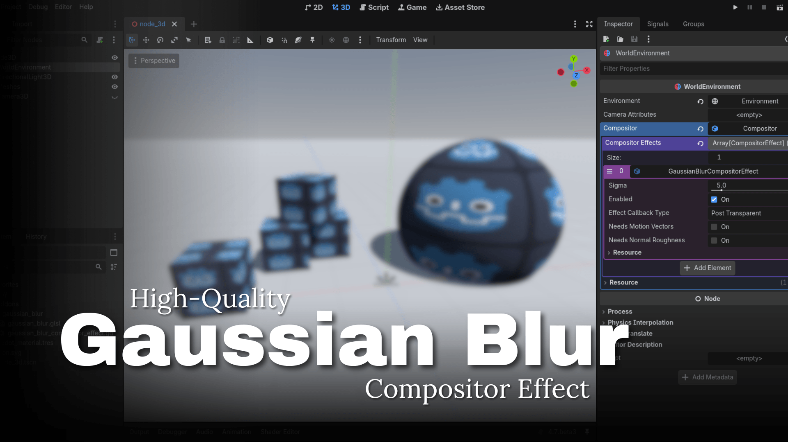

## Gaussian Blur CompositorEffect for Godot 4.6+

This add-on implements the high-quality and optimized `GaussianBlurCompositorEffect`. The strength of the blur is controlled by a `sigma` parameter which dictates the width of the Gaussian kernel used. The compute shader adjusts the number of texture lookups according to the `sigma` value, meaning that a subtle blur is cheap, and a strong blur is more expensive.

No lookup tables are used in computing the Gaussian function. It is always computed exactly for the given `sigma` value, producing an accurate and smooth blur.

### Technical overview

Since the Gaussian kernel is separable, the blur is implemented in two passes, reducing the number of per-pixel texture lookups from (2N+1)² to 2(2N+1) for kernel radius N.

1. Pass: Convolve the viewport's color image with a horizontal kernel. Write to "pong" buffer.

2. Pass: Convolve the "pong" buffer again with a vertical kernel. Render back to viewport.

Furthermore, since the linear filter implemented on graphics hardware can be manipulated to return two texels at once, the number of texture lookups is further reduced from 2(2N+1) to 2(N+1). This technique is detailed in [this blog](https://lisyarus.github.io/blog/posts/compute-blur.html).

Lastly, using a forward-differencing technique detailed in [GPU Gems 3](https://developer.nvidia.com/gpugems/gpugems3/part-vi-gpu-computing/chapter-40-incremental-computation-gaussian), the computation of the Gaussian function itself becomes negligible for any kernel size, only requiring a single vector multiplication per iteration.
